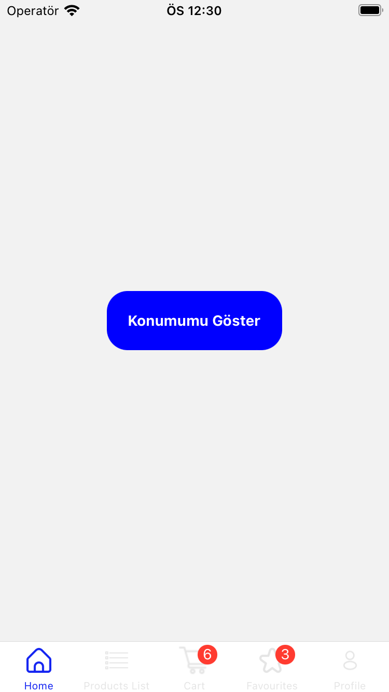
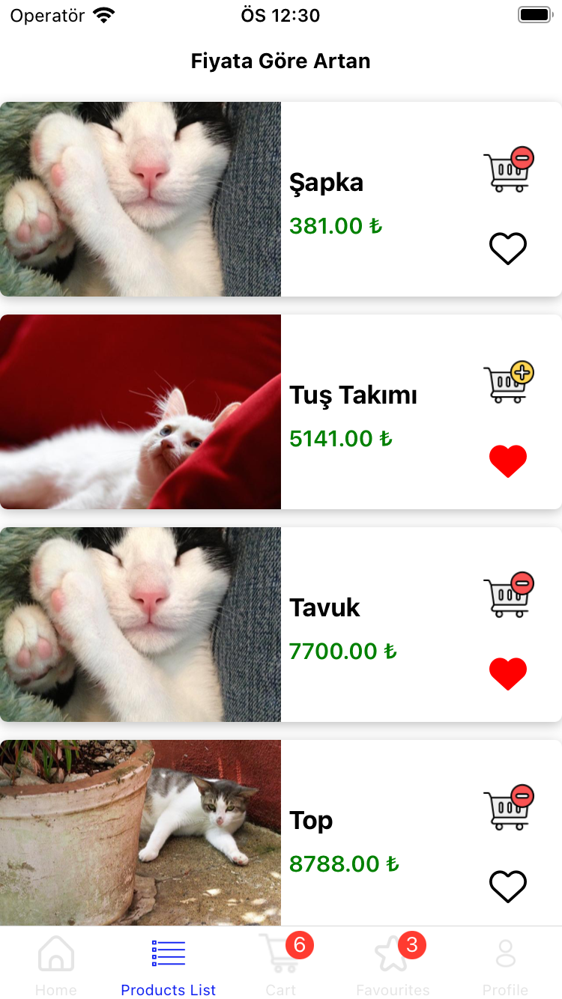
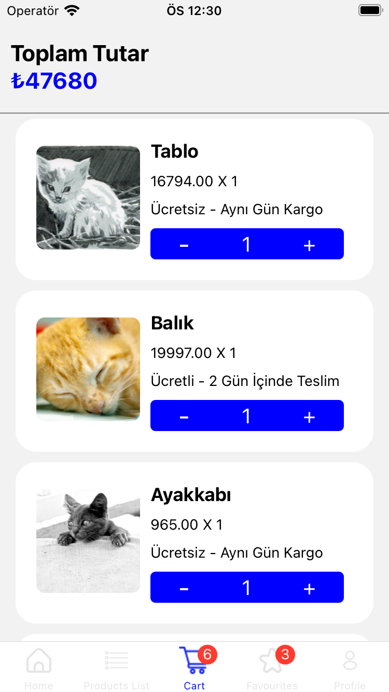
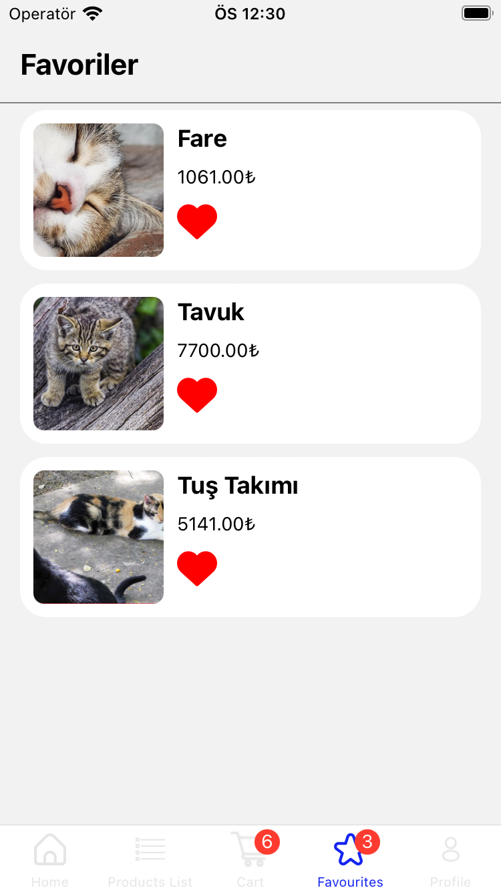
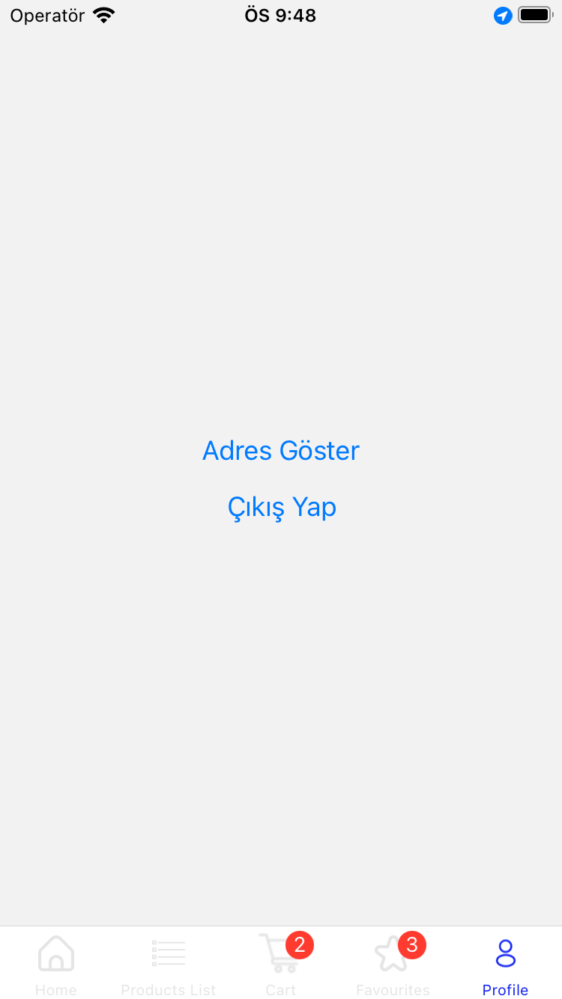
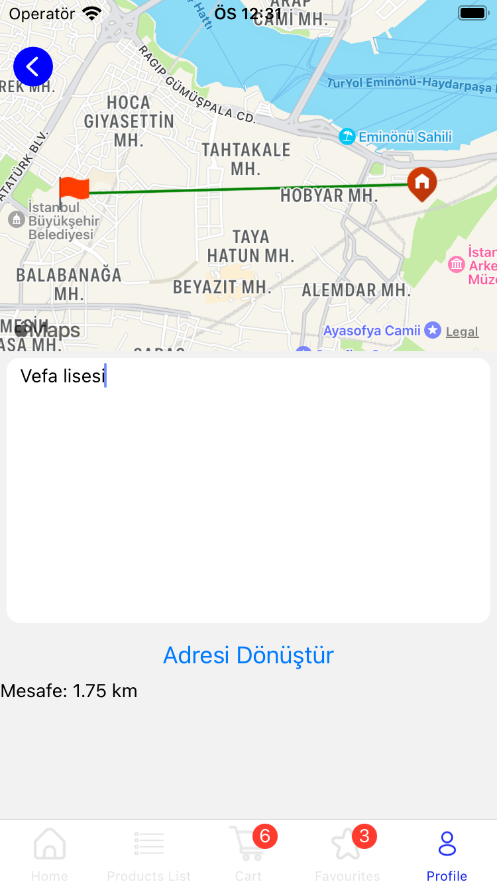

# 🌟 Basic E-Commerce Mobile App Challenge with Redux and react-native-maps

## Table of Contents 📚

- [About The Challenge](#-about-the-app)
- [Project Structure](#-project-structure)
- [Screenshots](#-screenshots)
- [Technologies](#%EF%B8%8F-technologies)
- [Setup](#-setup-instructions)

## 📱 About The App

Basic E-Commerce Mobile App Challenge with Redux and react-native-maps is a simple yet powerful mobile application developed as part of a React Native development assignment. This app serves as a platform for browsing and exploring various products, making it easier for users to discover and learn more about the items available for purchase.

## 📁 Project Structure

<pre>
📁 __mocks__               # Mocks for testing
📁 __tests__               # Test files
📁 .github
   📁 workflows            # GitHub Actions workflows
📁 assets
   📁 icons                # Icon assets
   📁 images               # Image assets
📁 docs                    # Documentation files
   📁 fonts                # Font files
   📁 scripts              # Scripts used in documentation
   📁 styles               # Styles for documentation
📁 Redux                   # Redux related files
📁 src                     # Source code
   📁 assets               # Application assets
   📁 components           # Reusable components
   📁 Constants            # Constants and configuration
   📁 helper               # Helper functions
   📁 Route                # Navigation routes
   📁 Views                # Main application views
📁 .gitignore              # Git ignore file
📜 .eslintignore           # ESLint ignore file
📜 .eslintrc.js            # ESLint configuration
📜 App.js                  # Main application entry point
📜 app.json                # Application configuration
📜 eas.json                # eas configuration
📜 babel.config.js         # Babel configuration
📜 jest.config.js          # Jest testing configuration
📜 jsdoc.conf.json         # JSDoc configuration
📜 package.json            # Node.js package configuration
📜 README.md               # Project documentation
📜 tsconfig.json           # TypeScript configuration
</pre>

## 📸 Screenshots

<div align="center">
  
  
</div>

<div align="center">
  
  
</div>

<div align="center">
  
  
</div>

<div align="center">
  
  
</div>

<div align="center">
  
  
</div>

## 🛠️ Technologies

The mobile app leverages the following key technologies and libraries:

- **React Native (TypeScript)**: The foundation of the app, allowing for cross-platform mobile development with strong typing and code quality. 📱

- **Redux Toolkit**: Used for state management, ensuring a consistent and predictable application state. 🔄

- **React Navigation**: Provides navigation and routing capabilities for creating a structured and intuitive app flow.

- **Expo**: A comprehensive framework and toolset for building React Native applications with ease. 📦

- **Async Storage**: Used to persist data locally, enhancing the user experience. 📂

- **Axios**: A popular HTTP client for making network requests and handling API interactions. 🌐

- **React Native Maps**: Enables the integration of maps and location-based services within the app. 🗺️

- **Jest**: A testing framework used for unit testing and ensuring the app's reliability. 🧪

- **React Native Vector Icons**: A library for easily integrating icons into the app's user interface. ✨

These core technologies, along with others, come together to create a powerful and user-friendly e-commerce app.

## 🚀 Setup Instructions

To get started with the **expo-e-commerce** mobile app on your local development environment, follow these steps:

#### ✅ Prerequisites

Before you begin, make sure you have the following prerequisites installed:

- [Node.js](https://nodejs.org/): Ensure you have Node.js installed. You can download it from the official website.

- [npm](https://www.npmjs.com/) or [Yarn](https://yarnpkg.com/): Choose either npm or Yarn as your package manager.

- [Expo CLI](https://docs.expo.dev/get-started/installation/): Install Expo CLI globally on your machine.

### 🚚 Install Dependencies

```shell
npm install
```

### 🏃‍♀️ Start the Development Server

To run the app in development mode, use the following commands:

#### 🏁 Start Project :

```shell
npm start
```

#### 🍎 iOS Simulator (requires macOS and Xcode):

```shell
npm run ios
```

#### 🤖 Android Emulator (requires Android Studio):

```shell
npm run android
```

### 🧪 Testing

```shell
npm test
```

### 📖 Documentation

```shell
npm run docs
```
